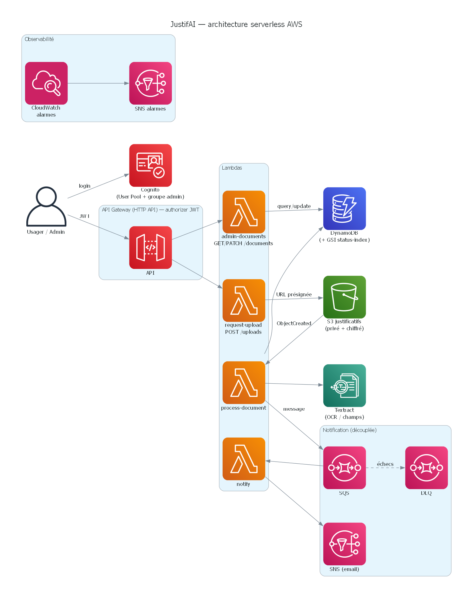

# JustifAI : dépôt intelligent de justificatifs administratifs

> Application **serverless** sur AWS : un usager dépose un justificatif (pièce
> d'identité, justificatif de domicile, attestation…), **Amazon Textract**
> extrait automatiquement le texte et les champs clés, le document est classé
> et son statut suivi de bout en bout, avec notification à l'usager.

Projet vitrine **Cloud & DevOps** : architecture event-driven, IaC Terraform,
CI/CD GitHub Actions. Pensé pour rester dans le **free tier** AWS (pay-per-use,
aucun serveur allumé en permanence).

## Architecture



> Diagramme éditable dans [`docs/architecture.drawio`](docs/architecture.drawio)
> (à ouvrir sur [draw.io](https://app.diagrams.net)). Une variante générée en
> **diagram-as-code** est aussi disponible (`docs/architecture.py`, lib
> [`diagrams`](https://diagrams.mingrammer.com/) + Graphviz) : reproductible et
> versionnée - `python docs/architecture.py` → `docs/architecture-as-code.png`.

Détails et décisions d'architecture : [docs/architecture.md](docs/architecture.md).

## Stack

| Domaine | Services / Outils |
| --- | --- |
| Compute | AWS Lambda (Node.js 20) |
| Stockage | Amazon S3, DynamoDB |
| IA managée | Amazon Textract |
| Intégration | API Gateway (HTTP API), SQS, SNS |
| Identité | Amazon Cognito, IAM (moindre privilège) |
| Diffusion | CloudFront, Route 53, ACM |
| Observabilité | Amazon CloudWatch |
| IaC | Terraform |
| CI/CD | GitHub Actions |

## Cas d'usage

1. L'usager s'authentifie (Cognito) et demande une **URL d'upload signée**.
2. Il dépose son justificatif dans S3 via cette URL.
3. L'événement S3 déclenche le traitement : **Textract** extrait le contenu, le
   document est classé (type, validité) et son statut écrit dans DynamoDB.
4. Un message SQS déclenche la **notification** (SNS -> email).
5. L'usager suit le statut ; un admin peut revoir les cas ambigus.

## Structure

```
justifai/
├── docs/                 # architecture & post LinkedIn
├── frontend/             # SPA React (Vite) — upload + suivi
├── backend/lambdas/      # fonctions Lambda (Node.js)
├── terraform/            # infrastructure as code (modules réutilisables)
│   └── modules/          # storage, messaging, auth, compute, api, monitoring
└── .github/workflows/    # CI (fmt / validate / plan)
```

## Démarrage rapide

Pré-requis : Node.js 20+, Terraform 1.6+, un compte AWS + AWS CLI configuré.

```bash
cp .env.example .env
cd terraform
terraform init
terraform plan            # prévisualiser l'infrastructure
# terraform apply         # (déploiement — crée des ressources AWS)
```

> Pense à `terraform destroy` après démonstration pour éviter tout coût résiduel.

Runbook complet (déploiement, user admin Cognito, démo, nettoyage) :
[docs/DEPLOY.md](docs/DEPLOY.md).

## Coût

Conçu pour le **free tier** : Lambda, DynamoDB (on-demand), S3, SQS/SNS et
Textract (1 000 pages/mois gratuites la première année) restent proches de
**0 $/mois** pour une démo. Aucune ressource « toujours allumée » (pas d'EC2,
NAT ni RDS).

## Statut

Fonctionnel de bout en bout au niveau IaC + code. Réalisé :

- ✅ Infrastructure Terraform complète (S3, DynamoDB, SQS/DLQ, SNS, 3 Lambdas,
  API Gateway, IAM moindre privilège) — `terraform validate` OK.
- ✅ **Authentification Cognito** (User Pool + client SPA) et **authorizer JWT**
  devant l'API — l'API n'est plus ouverte.
- ✅ **Alarmes CloudWatch** : erreurs des 3 Lambdas + profondeur de la DLQ.
- ✅ Frontend React connecté à Cognito (login) et à l'API (build Vite OK).
- ✅ CI GitHub Actions : `terraform fmt/validate`, `node --check`, build frontend.

- ✅ **Infrastructure modularisée** : 6 modules Terraform réutilisables
  (storage, messaging, auth, compute, api, monitoring).

- ✅ **Dashboard admin** : revue des documents en statut `REVIEW` (groupe
  Cognito `admin`, endpoints `GET/PATCH /documents`).

Prochaine étape : CloudFront + Route 53 + ACM devant le front (HTTPS + domaine).

> Note : les alertes de sécurité npm restantes (`esbuild`/`vite`) concernent le
> **serveur de dev** uniquement et n'affectent pas le build de production.

## Auteur

Seydina Limamou Laye Yade - Cloud & DevOps Engineer · Dakar, Sénégal
[GitHub](https://github.com/seydinalimamoulayeyade) ·
[LinkedIn](https://linkedin.com/in/limamou-laye) · Licence MIT
